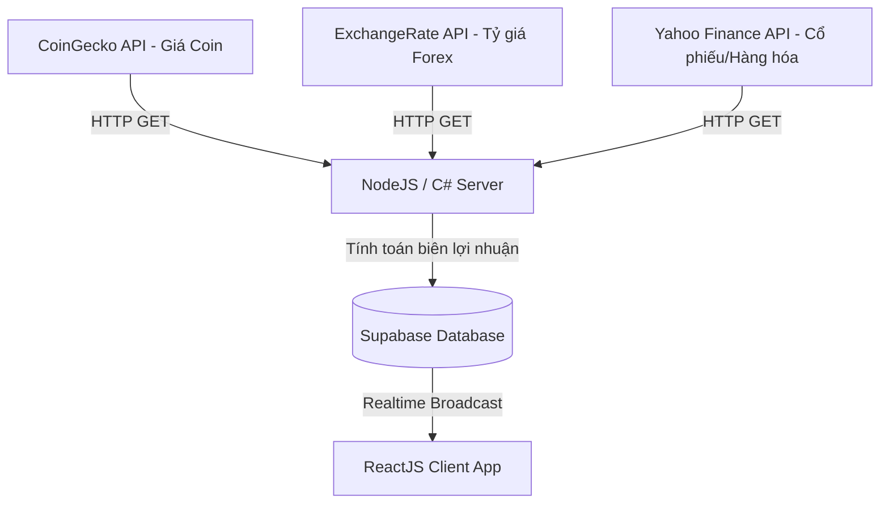

# Ý tưởng Đột phá: Sàn Giao Dịch Liên Kết Tỷ Giá & Thị Trường Tài Chính Thực
## Dự án: Food Stock Exchange (Forex & Commodity Edition)

Ý tưởng liên kết giá món ăn của nhà hàng với **Tỷ giá ngoại tệ (Forex)**, **Giá cổ phiếu (Stocks)**, hoặc **Giá hàng hóa thế giới (Commodity Futures)** là một sự sáng tạo ở cấp độ cực cao. Nó biến nhà hàng của bạn thành một "Trading Floor" (Sàn giao dịch) thực thụ, nơi biến động của thế giới ảnh hưởng trực tiếp đến bàn nhậu.

Dưới đây là thiết kế chi tiết cho ý tưởng độc lạ này:

---

## 1. Cơ chế Liên kết Tỷ giá (Asset-to-Menu Mapping)

Ta sẽ gán mỗi nhóm món ăn/đồ uống trong menu với một chỉ số tài chính thực tế ngoài đời thực:

| Nhóm sản phẩm tại quán | Chỉ số Tài chính Liên kết | Ví dụ thực tế |
|---|---|---|
| **Cà phê / Trà** | **Coffee Futures / Cocoa Futures** (Giá cà phê hạt/ca cao trên sàn London/New York) | Hôm nay giá cafe thế giới tăng mạnh → Ly Cà Phê Sữa Đá của khách tăng từ 29k lên 34k. |
| **Bia / Đồ uống nhập khẩu** | **Tỷ giá Forex tương ứng** (EUR/VND cho Heineken, JPY/VND cho Sapporo) | Đồng Yên Nhật giảm giá → Giá bia Sapporo tại quán giảm mạnh, khách tranh nhau uống đồ Nhật giá rẻ. |
| **Món ăn cao cấp (Steak, Sushi)** | **Chỉ số Vàng (XAU/USD) hoặc S&P 500** | Giá vàng thế giới lập đỉnh → Món Bò Wagyu dát vàng vọt lên mức giá trần. |
| **Món ăn xu hướng giới trẻ** | **Giá Bitcoin (BTC/USD)** (CoinGecko API) | Bitcoin tăng 5% trong ngày → Giá Trà Sữa Trân Châu tăng theo để kích thích các "Traders" chốt lời gọi đồ ngọt. |

---

## 2. Thiết kế Kiến trúc Hệ thống với API ngoài

Để hiện thực hóa điều này, Backend cần tích hợp thêm một số API tài chính miễn phí hoặc giá rẻ:

### Các API được đề xuất sử dụng:
1.  **ExchangeRate-API** (Miễn phí 1500 request/tháng): Lấy tỷ giá EUR, USD, JPY, MXN quy đổi ra VND.
2.  **CoinGecko API** (Miễn phí, không cần key): Lấy giá Bitcoin (BTC) và Ethereum (ETH) theo thời gian thực.
3.  **Yahoo Finance API** (Qua thư viện `yahoo-finance2` trên npm): Lấy giá các hợp đồng tương lai nông sản (Coffee, Sugar, Wheat).

---

## 3. Quy tắc Nghiệp vụ bổ sung (Margin & Safety Rules)

Vì giá cả thị trường tài chính thế giới biến động ngoài tầm kiểm soát của quán, hệ thống bắt buộc phải có các quy tắc bảo vệ:

### BR-Forex-01: Quy tắc chênh lệch biên (Margin Buffer)
Giá bán của món ăn sẽ được tính bằng công thức tỷ lệ thuận với tỷ giá thực tế, nhưng luôn cộng thêm một biên lợi nhuận cố định của quán (Margin Buffer):
$$P_{current} = (Chỉ\_số\_Tài\_chính \times Hệ\_số\_quy\_đổi) + Biên\_lợi\_nhuận\_quán$$

### BR-Forex-02: Chốt chặn an toàn (Hard Floor & Hard Ceiling)
Tương tự như quy tắc cũ, dù giá Bitcoin có giảm về 0 hay giá vàng có tăng gấp 10 lần, hệ thống tuyệt đối không được để giá bán vượt ra ngoài khoảng $[P_{min}, P_{max}]$ đã cấu hình trong bảng `products` để bảo vệ dòng tiền của quán.

### BR-Forex-03: Cập nhật giãn cách (Throttle Updates)
*   Tỷ giá Forex và Hàng hóa thế giới không cần cập nhật theo từng giây như sàn coin.
*   Hệ thống chỉ nên gọi API ngoài **mỗi 5 phút hoặc 15 phút một lần** để tránh bị giới hạn băng thông (Rate limit) của các API miễn phí, đồng thời giữ giá món ăn ổn định vừa đủ để khách kịp order.
