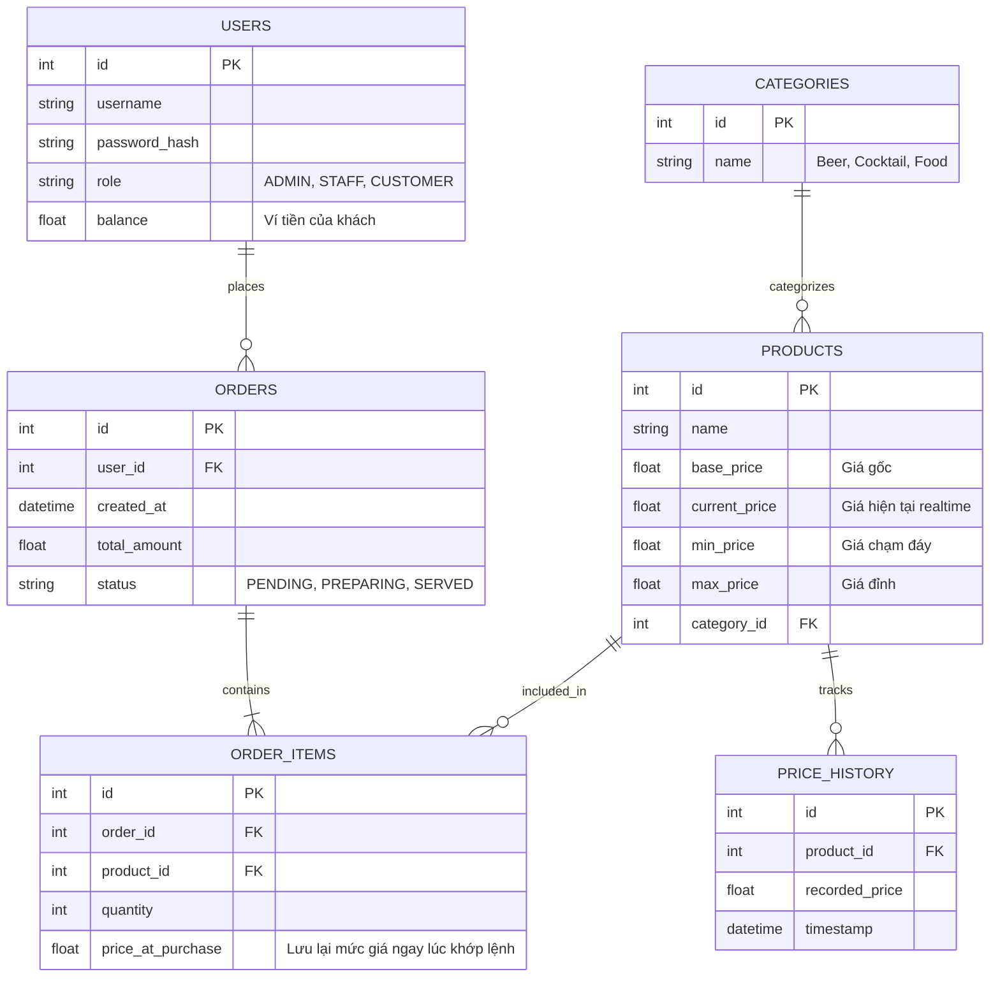

# Kế hoạch Triển khai Dự án: Food Stock Exchange

Kế hoạch này thiết lập kiến trúc kỹ thuật cấp cao (High-level Architecture) cho dự án Sàn giao dịch Ẩm thực.

## User Review Required

> [!IMPORTANT]
> Tôi đã chuẩn bị các tài liệu `software_requirements.md` và `business_rules.md`. Vui lòng xem qua để thấy sự hoành tráng của hệ thống này.
> Để bước sang giai đoạn khởi tạo code (Execution Phase), bạn cần chốt lại câu hỏi ở phần Open Questions dưới đây.

## Open Questions

> [!WARNING]
> **Về công nghệ Backend:** Bạn quyết định sử dụng **Node.js** (với Socket.io) hay **C# (.NET Core)** (với SignalR)?
> *(Cả 2 ngôn ngữ đều xuất sắc cho hệ thống Real-time, bạn hãy chọn ngôn ngữ mà bạn tự tin nhất hoặc muốn học sâu nhất để tôi setup source code cho chuẩn).*

## Proposed Architecture (Kiến trúc Dữ liệu - ERD)

Dưới đây là sơ đồ cơ sở dữ liệu quan hệ cốt lõi để giải quyết bài toán sàn giao dịch:

### Kiến trúc Luồng Dữ Liệu (Data Flow)

1. **Client (ReactJS)** mở kết nối WebSocket tới **Server**.
2. Một tiến trình ngầm (Background Worker) trên Server lặp mỗi 10 giây:
   - Truy vấn số lượng đơn hàng (`ORDER_ITEMS`) trong 5 phút qua.
   - Cập nhật trường `current_price` của `PRODUCTS`.
   - Lưu một dòng vào `PRICE_HISTORY` để vẽ biểu đồ đường cho UI.
   - Gửi (Broadcast) giá mới qua WebSocket tới tất cả Client.
3. Khi người dùng bấm MUA, gọi RESTful API `/api/orders`, server kiểm tra số dư ví (`balance`) và lưu `ORDER` với giá `current_price` ngay tại lúc đó.

## Verification Plan

Sau khi bạn chốt ngôn ngữ Backend, tôi sẽ:
1. Viết các lệnh CLI để khởi tạo cấu trúc thư mục (Npx create-react-app / dotnet new webapi / npm init).
2. Thiết lập thư mục và các file base đầu tiên.
3. Tạo file `task.md` chia nhỏ quá trình code.
