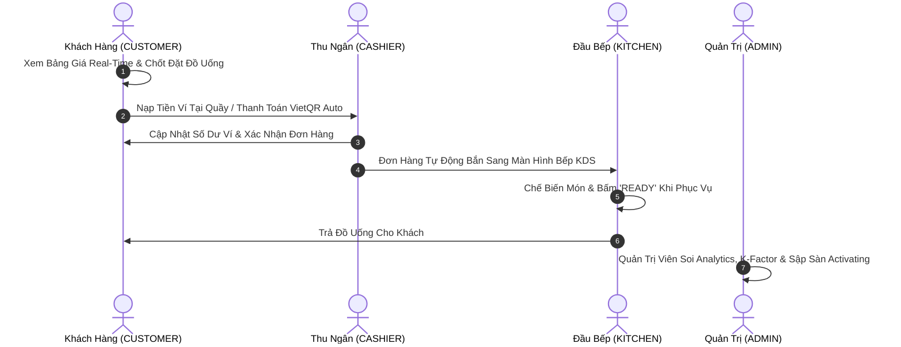

# Ma Trận Phân Quyền & Quy Trình Nghiệp Vụ Theo Vai Trò (Role & Operations Matrix)

Hệ thống **Food Stock Exchange** được thiết kế chuẩn doanh nghiệp với 4 Vai trò (Role) độc lập, đảm bảo tính phân tách trách nhiệm (Separation of Duties - SoD) và tối ưu hóa vận hành nhà hàng/quán bar:

---

## 🎭 Bảng Tổng Quan Các Vai Trò (Role Overview Matrix)

| Vai Trò (Role) | Mã Role SQL | Quyền Hạn Giao Diện (UI Access) | Chức Năng Nghiệp Vụ Thực Tế |
|---|---|---|---|
| **Khách Hàng / Trader** | `CUSTOMER` | Tab **BẢNG GIAO DỊCH** | • Xem bảng giá nến 10s & biến động real-time. • Đặt lệnh mua ngay (1-Touch) hoặc Lệnh chờ (Limit Order). • Mua/Bán lại suất uống trên Chợ Thứ Cấp P2P. • Nạp tiền ngân hàng VietQR tự động (SePAY Webhook). • Trò chuyện tư vấn cùng **AI Broker Cạ Nhậu**. |
| **Nhân Viên Thu Ngân** | `CASHIER` | Tab **THU NGÂN (POS)** & **BẢNG GIAO DỊCH** | • Nạp tiền ví điện tử tại quầy trực tiếp cho khách. • Tra cứu hồ sơ Trader theo Tên/SĐT. • Xác nhận thanh toán & In hóa đơn nhiệt ESC/POS. • Theo dõi doanh thu tiền mặt / chuyển khoản ca trực. |
| **Nhân Viên Bếp / Barista** | `KITCHEN` | Tab **MÀN HÌNH BẾP (KDS)** & **BẢNG GIAO DỊCH** | • Nhận phiếu chế biến KDS sắp xếp theo thời gian order. • Theo dõi cảnh báo đếm ngược SLA (Xanh: <5p, Vàng: 5-10p, Đỏ: >10p). • Chuyển trạng thái đơn: `PREPARING` ➔ `READY` ➔ `SERVED`. • Báo hết hàng nguyên liệu thô (BOM Inventory Alert). |
| **Ban Quản Trị / Chủ Quán** | `ADMIN` | **TOÀN BỘ 4 TAB** (Admin, POS, KDS, Trading) | • Điều phối gia tốc biến động giá (K-factor Amplifier). • Cấu hình thời gian xả giá cool-down. • Nút khẩn cấp sập sàn (PANIC CRASH) hoạt náo. • Quản lý danh sách tài khoản & Phân quyền Role. • Nạp/Sửa số dư ví trực tiếp. • Đồng bộ Menu Quốc Tế & Đặc Sản Việt Nam. • Điều khiển giả lập đèn RGB IoT Smart Bar Lighting. |

---

## 🔄 Quy Trình Phối Hợp Nghiệp Vụ Giữa Các Vai Trò (Cross-Role Workflow)

---

## 🛡 Bảo Mật & Kiểm Soát Truy Cập (Access Control Security)
- **Token JWT Validation**: Mọi endpoint Backend được bảo vệ bởi middleware `auth(['ROLE_NAME'])`.
- **Role-based Navigation**: Thanh Main Navbar tự động ẩn/hiện các tab phù hợp với Role đăng nhập, ngăn chặn việc truy cập trái phép.
