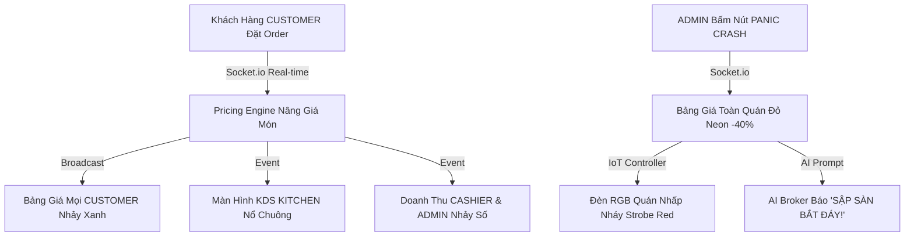

# Báo Cáo Phân Tích Sáng Tạo, Liên Kết Real-Time & Lợi Thế Cạnh Tranh Khởi Nghiệp (Startup Competitiveness & Innovation Matrix)

Hệ thống **Food Stock Exchange** không chỉ là một ứng dụng bán hàng thông thường, mà là một **Mô hình Khởi nghiệp Công nghệ Ẩm thực (FoodTech & FinTech Startup)** mang tính đột phá toàn cầu. 

---

## 💡 1. Sự Sáng Tạo Đột Phá Của 4 Vai Trò (Role Innovations)

### 1.1 Khách Hàng (`CUSTOMER`) - Từ Người Ăn Uống Thành "Trader" Săn Giá
- **Tạo ra Thị trường Giao dịch Thực sự**: Khách hàng không bị thụ động xem menu cố định. Họ được trải nghiệm cảm giác giao dịch tài chính với biểu đồ nến 10s.
- **Tính năng Lệnh Tự Động (Limit Order)**: Đặt mốc giá mong muốn (VD: Bia 25k), khi sàn giảm đúng giá thì hệ thống tự khớp lệnh mua.
- **Chợ Thứ Cấp P2P**: Cho phép bán lại món ăn/đồ uống đã mua cho bàn khác để ăn chênh lệch giá.
- **AI Broker Cạ Nhậu**: Chatbot AI đóng vai cạ cứng phím hàng real-time.

### 1.2 Thu Ngân (`CASHIER`) - Ngân Hàng Thanh Khoản Trực Tiếp (Liquidity Provider)
- Tích hợp SePAY VietQR Auto Top-up nạp tiền tức thì 24/7.
- Xác nhận đơn hàng, quản lý doanh thu theo ca trực real-time và in hóa đơn nhiệt ESC/POS.

### 1.3 Bếp / Barista (`KITCHEN`) - Động Cơ Phục Vụ Tốc Độ Cao & Điều Tiết Định Mức Nguyên Liệu
- Màn hình KDS thông minh xếp thứ tự order theo thời gian thực kèm đếm ngược SLA màu sắc.
- **Liên kết Kho thô (BOM Inventory)**: Bếp bấm báo hết nguyên liệu thô ➔ Thuật toán tự động kích hoạt **Circuit Breaker (Tạm dừng giao dịch món đó)** trên bảng giá toàn quán.

### 1.4 Ban Quản Trị (`ADMIN`) - Nhà Tạo Lập Thị Trường (Market Maker) &IoT Orchestrator
- **Nút Khẩn Cấp PANIC CRASH**: Tạo hiệu ứng giảm kịch sàn 40% trong 3 phút làm hoạt náo quán.
- **IoT Smart Lighting**: Đồng bộ hệ thống đèn RGB toàn không gian theo trạng thái thị trường.

---

## ⚡ 2. Ma Trận Liên Kết Real-Time Chuỗi Phản Ứng (Real-Time Chain Reaction Matrix)

---

## 🚀 3. Lợi Thế Cạnh Tranh & Tiềm Năng Khởi Nghiệp VC-Grade (Startup Scalability)

1. **Gamification Tăng Doanh Số 35-50%**: Biến trải nghiệm uống bia thành trò chơi săn giá tài chính, kích thích khách hàng gọi liên tục.
2. **Tối Ưu Hóa Tồn Kho & Xả Hàng Tự Động**: Các món ít người gọi tự động xả giá cool-down, giúp quán giảm tỷ lệ lãng phí nguyên liệu hỏng về 0%.
3. **Mô Hình Đóng Gói SaaS Nhân Rộng Toàn Cầu**: Dễ dàng triển khai nhượng quyền (Franchise) hoặc bán bản quyền phần mềm SaaS cho hàng ngàn chuỗi Bar, Pub, Lounge, Restaurant trên toàn cầu.
